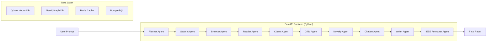

# ResearchOS

[](https://python.org)
[](https://fastapi.tiangolo.com)
[](https://nextjs.org)
[](https://typescriptlang.org)
[](https://render.com)
[](LICENSE)

**Autonomous Multi-Agent Research Laboratory** — ResearchOS accepts short research prompts and autonomously produces IEEE-grade academic papers with verified citations. It orchestrates 10 specialized AI agents through a LangGraph pipeline backed by OpenRouter models.

---

## Features

- **10 Specialized AI Agents** — Planner, Search, Browser, Reader, Claims, Critic, Novelty, Citation, Writer, IEEE Formatter
- **LangGraph Orchestration** — StateGraph-based pipeline with checkpointing and recovery
- **IEEE-Compliant Output** — Formatted papers with verified citations, traceable claims
- **Multi-Provider LLM Routing** — Auto-fallback across Gemini, Gemma, Nemotron, OpenRouter, OpenAI, Grok, Manus
- **Live WebSocket Updates** — Real-time progress streaming to the frontend
- **RAG-Powered Retrieval** — Hybrid search (BM25 + vector embeddings) with re-ranking
- **Knowledge Graph** — Neo4j-backed claim-source-concept graph for traceability
- **Browser Automation** — Playwright-powered web scraping and article extraction
- **PDF Generation** — Client-side PDF rendering with PyMuPDF and fpdf2

---

## Architecture Diagram



---

## Tech Stack

| Layer | Technology |
|-------|-----------|
| Frontend | Next.js 15, TypeScript, Tailwind CSS, Framer Motion |
| Backend | FastAPI, Python 3.12+, async |
| Orchestration | LangGraph StateGraph |
| LLM | OpenRouter (Qwen3, Gemma4, Hermes 405B) |
| Vector DB | Qdrant |
| Graph DB | Neo4j |
| Cache | Redis |
| Relational DB | PostgreSQL |
| Browser | Playwright |
| Document | PyMuPDF |
| Container | Docker Compose |

---

## Folder Structure

```
researchos/
├── .env.example              # Root-level env guidance
├── .gitignore                # Git ignore rules
├── docker-compose.yml         # Full-stack local dev with databases
├── render.yaml                # Render deployment config
├── README.md                  # This file
├── backend/
│   ├── main.py                # FastAPI application entry point
│   ├── pyproject.toml         # Backend Python project config
│   ├── requirements.txt       # Backend dependencies
│   ├── .env.example           # Backend environment template
│   ├── agents/                # 10 research agents
│   │   ├── planner.py
│   │   ├── search.py
│   │   ├── firecrawl_extract.py
│   │   ├── reader.py
│   │   ├── claim_extractor.py
│   │   ├── critic.py
│   │   ├── novelty.py
│   │   ├── citation.py
│   │   ├── writer.py
│   │   └── ieee_formatter.py
│   ├── api/                   # REST + WebSocket routes
│   │   ├── routes/
│   │   │   ├── research.py
│   │   │   ├── agents.py
│   │   │   ├── diagnostics.py
│   │   │   └── ws.py
│   │   └── deps.py
│   ├── config/                # Settings & model routing
│   ├── graph/                 # LangGraph workflow & state
│   ├── schemas/               # Pydantic models
│   ├── services/              # LLM, search, browser, PDF
│   ├── memory/                # Redis, Qdrant, Neo4j, Postgres
│   ├── retrieval/             # Hybrid RAG (BM25 + vector)
│   ├── workers/               # Background task queue
│   └── tests/                 # Backend test suite
├── frontend/
│   ├── src/
│   │   ├── app/               # Next.js pages
│   │   ├── components/         # React components
│   │   │   ├── research/       # Research UI components
│   │   │   └── three/          # 3D background effects
│   │   ├── hooks/             # WebSocket & research hooks
│   │   ├── stores/            # Zustand state management
│   │   └── lib/               # API client, types, utils
│   ├── public/                # Static assets
│   ├── .env.example           # Frontend env template
│   ├── package.json
│   └── next.config.ts
├── infra/
│   ├── postgres/               # PostgreSQL init scripts
│   └── neo4j/                  # Neo4j constraints
└── sample/                     # Sample PDF papers
```

---

## Installation

### Prerequisites

- Python 3.12+
- Node.js 20+
- Docker & Docker Compose
- OpenRouter API key (get one at https://openrouter.ai)

### 1. Clone the repository

    git clone https://github.com/Amarnadh-ind/ResearchOS.git
    cd ResearchOS

### 2. Configure environment

    cp .env.example .env
    cp backend/.env.example backend/.env
    cp frontend/.env.example frontend/.env.local
    # Edit the .env files and add your OPENROUTER_API_KEY

### 3. Start databases (optional, for local dev)

    docker compose up postgres redis qdrant neo4j -d

### 4. Install dependencies

**Backend:**

    cd backend
    python -m venv .venv
    source .venv/bin/activate  # Linux/Mac
    pip install -r requirements.txt
    playwright install chromium

**Frontend:**

    cd frontend
    npm install

### 5. Run locally

**Backend:**

    uvicorn main:app --reload --host 0.0.0.0 --port 8000

**Frontend:**

    npm run dev

Both services will be available at:
- **Frontend**: http://localhost:3000
- **Backend API**: http://localhost:8000
- **API Docs**: http://localhost:8000/docs

---

## Environment Variables

### Backend (backend/.env.example)

| Variable | Description | Required |
|----------|-------------|----------|
| GEMINI_API_KEY | Google Gemini API key | No (falls back to mock) |
| GEMMA_API_KEY | Gemma API key | No (falls back to mock) |
| NEMOTRON_API_KEY | NVIDIA NIM API key | No (falls back to mock) |
| OPENROUTER_API_KEY | OpenRouter API key | No (falls back to mock) |
| OPENAI_API_KEY | OpenAI API key | No (falls back to mock) |
| GROK_API_KEY | Grok API key | No (falls back to mock) |
| MANUS_API_KEY | Manus API key | No (falls back to mock) |
| FIRECRAWL_API_KEY | Firecrawl web scraping | No |
| TAVILY_API_KEY | Tavily search | No |
| LLM_PROVIDER | Preferred provider: auto | Yes (default: auto) |
| MOCK_LLM | Force mock output | No (default: false) |
| BACKEND_HOST | Bind host | No (default: 0.0.0.0) |
| BACKEND_PORT | Bind port | No (default: 8000) |
| DEBUG | Debug mode | No (default: false) |
| LOG_LEVEL | Logging level | No (default: info) |
| CORS_ORIGINS | Allowed frontend origins | No |
| Database vars | PostgreSQL, Redis, Qdrant, Neo4j | No (defaults to localhost) |
| FAST_MODE | Use fast pipeline mode | No (default: true) |

### Frontend (frontend/.env.example)

| Variable | Description | Required |
|----------|-------------|----------|
| NEXT_PUBLIC_API_URL | Backend API URL | No (default: http://localhost:8000) |
| NEXT_PUBLIC_WS_URL | WebSocket URL | No (default: ws://localhost:8000) |

---

## Local Development

1. Start databases: docker compose up postgres redis qdrant neo4j -d
2. Start backend: cd backend && uvicorn main:app --reload
3. Start frontend: cd frontend && npm run dev
4. Open http://localhost:3000

### Running Tests

    cd backend
    python -m pytest tests/ -v

Linting (ruff):

    cd backend
    ruff check .
    ruff format .

---

## Render Deployment

Deploy the backend to Render using the included render.yaml:

1. Push to GitHub (this repo)
2. Sign in to https://render.com with GitHub
3. Create a new External Service from the render.yaml file
4. Set the following environment variables in Render dashboard:
   - OPENROUTER_API_KEY — your OpenRouter key
   - GEMINI_API_KEY — your Gemini key (optional)
   - CORS_ORIGINS — your Vercel domain (e.g., https://researchos.vercel.app)
5. Render will auto-deploy on push

The frontend should be deployed separately on Vercel with NEXT_PUBLIC_API_URL pointing to the Render backend URL.

---

## API Overview

| Method | Endpoint | Description |
|--------|----------|-------------|
| POST | /api/research | Start a new research session |
| GET | /api/research/{id} | Get session status and progress |
| GET | /api/research/{id}/paper | Download the generated paper |
| GET | /api/research | List all research sessions |
| GET | /api/agents/status | Get agent configurations and health |
| GET | /api/agents/pipeline | Get pipeline structure and stages |
| GET | /health | Health check endpoint |
| WS | /ws/research/{id} | Live WebSocket updates for session progress |

---

## IEEE Paper Generation Workflow

1. **Planner** — Decomposes the user prompt into research questions and sub-tasks
2. **Search Agent** — Performs web search for each sub-question using DuckDuckGo or Tavily
3. **Browser Agent** — Extracts full article content from top search results using Playwright
4. **Reader Agent** — Summarizes and extracts key findings from each article
5. **Claims Agent** — Extracts factual claims from the research material
6. **Critic Agent** — Evaluates evidence quality and flags unsupported claims
7. **Novelty Agent** — Checks for novelty against existing literature
8. **Citation Agent** — Builds verified citation list with source URLs
9. **Writer Agent** — Drafts the paper sections in IEEE format
10. **IEEE Formatter** — Applies IEEE transaction formatting rules and validates structure

Each stage has verification gates — no claim is included without verified evidence, and no citation exists without a traceable source.

---

## Screenshots

> Add screenshots here after capturing them locally or from a deployed instance.

### Dashboard


### Research Pipeline


### Generated Paper Preview


---

## Contributing

1. Fork the repository
2. Create a feature branch: git checkout -b feat/your-feature
3. Make your changes and ensure tests pass
4. Commit with a descriptive message
5. Push to your fork and open a Pull Request

### Non-Negotiable Rules

| Rule | Description |
|------|-------------|
| RULE-1 | NO EVIDENCE = NO CLAIM |
| RULE-2 | NO SOURCE = NO CITATION |
| RULE-3 | No hallucinated references |
| RULE-4 | All citations must be verified |
| RULE-5 | Claims must be traceable |
| RULE-6 | Critique phase is mandatory |
| RULE-7 | Verification gates are mandatory |

---

## License

This project is licensed under the MIT License. See the LICENSE file for details.

---

## Credits

- Built with FastAPI, Next.js, and LangGraph
- LLM providers via OpenRouter
- Research agents for autonomous scientific literature review and IEEE paper generation